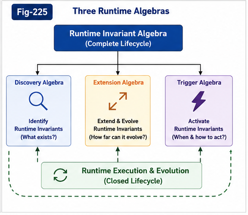
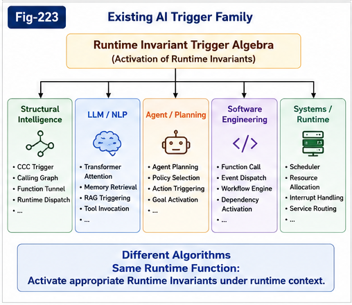
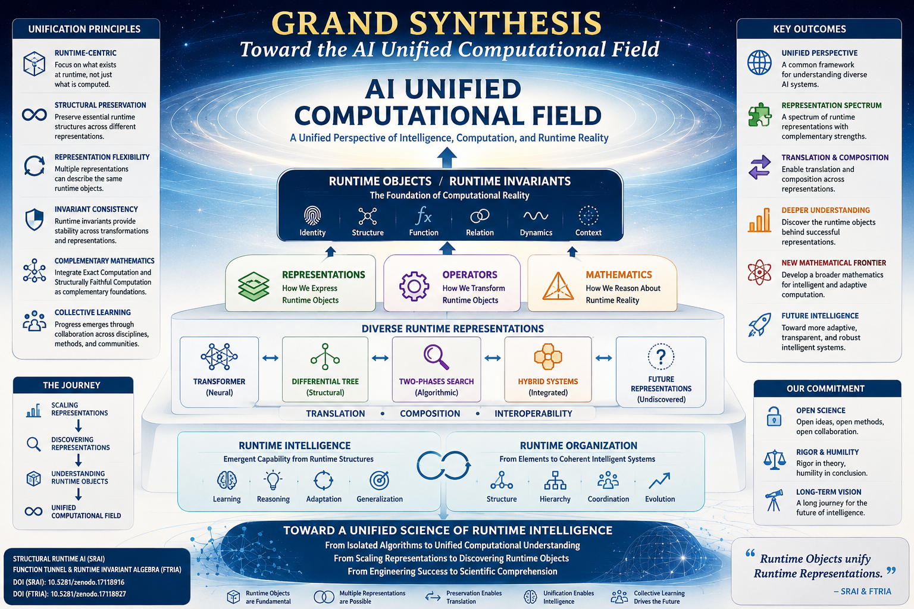
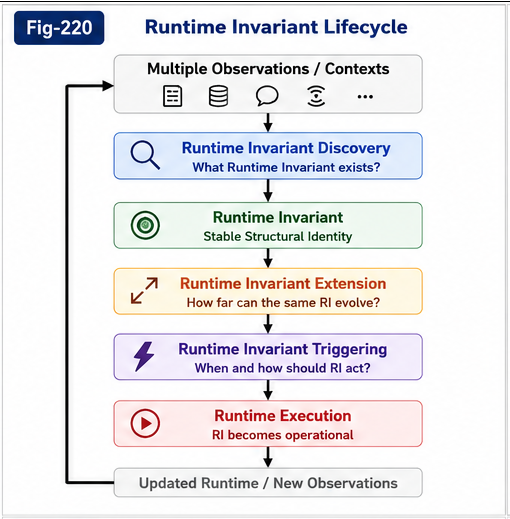
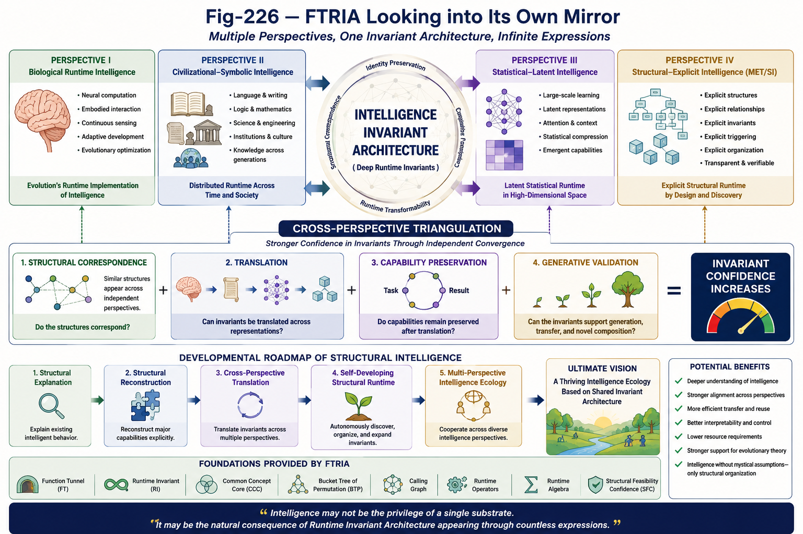

# Function Tunnel Runtime Invariant Algebra (FTRIA)

## From Runtime Invariant Geometry to Runtime Invariant Algebra

---

## Vision

Many successful algorithms in software engineering, Artificial Intelligence, and Structural Intelligence appear fundamentally different.

Transformer Attention, Common Concept Core (CCC), Differential Trees, Calling Graphs, Function Tunnels, Runtime Migration, Fine-Tuning, and numerous other systems are usually studied independently.

FTRIA proposes a different perspective.

Rather than beginning with algorithms, FTRIA begins with a common mathematical object:

> **The Runtime Invariant.**

A Runtime Invariant is a structural entity that preserves its identity while admitting multiple runtime realizations.

Once Runtime Invariants become explicit mathematical objects, many previously independent algorithms can be interpreted as different Runtime Operations acting upon the same underlying structures.

FTRIA therefore seeks to establish a common mathematical language for Runtime Intelligence.

---

# Repository Structure

## Part I — Runtime Invariant Geometry

---


---


---


---

Part I establishes the geometric foundations of Runtime Invariants.

Topics include

* Runtime Invariant Degrees of Freedom
* RI-Preserving Transformation
* Admissible Runtime Variation
* Constraint Surfaces
* Local and Global Degrees of Freedom
* Coupled Degrees of Freedom
* Runtime Invariant Configuration Space

The central question is:

> **What is a Runtime Invariant, and what is its admissible Runtime Space?**

---

## Part II — Runtime Invariant Algebra

---



---

Part II establishes the operational mathematics of Runtime Invariants.

Three major Runtime Algebras are introduced.

### Runtime Invariant Discovery

How Runtime Invariants are discovered from observations.

Representative topics include

* Runtime Invariant Discovery
* Common Concept Core (CCC)
* Runtime Alignment
* Runtime Structural Organization
* Runtime Invariant Discovery Pipeline
* Transformer Embeddings
* Transformer Attention

---

### Runtime Invariant Extension

How Runtime Invariants evolve while preserving structural identity.

Representative topics include

* RI-Preserving Transformation
* Runtime Invariant Extension
* Structural Generalization
* Future mappings to CCC Preserve Generation, Fine-Tuning, LoRA, PEFT, Runtime Migration, and related techniques

---

### Runtime Invariant Triggering

---



---

How Runtime Invariants become active during execution.

Representative topics include

* Runtime Trigger Algebra
* Runtime Context
* Runtime Activation
* Calling Graphs
* Function Tunnels
* Agent Runtime
* Transformer Runtime

---

# Part X — Grand Synthesis

## Toward the AI Unified Computational Field

The previous five parts of **Structural Runtime AI (SRAI)** established a runtime-centric theory of intelligence, including Metric Spaces, Structural Differences, Runtime Operators, Runtime Intelligence, Runtime Organization, and their engineering implications.

Throughout this journey, another observation gradually emerged.

Many concepts that initially appeared independent—including Function Tunnels (FT), Runtime Invariants (RI), Differential Trees, Two-Phases Search, Runtime Structural Organization, and even modern Transformer-based neural computation—began to reveal unexpected structural relationships.

This observation motivates **Part X — Grand Synthesis**.

---

#### Fig-600-Grand-Synthesis-Toward-the-AI-Unified-Computational-Field.png



---

Rather than introducing another algorithm or another architecture, Part X steps back to ask a broader scientific question:

> **Can Artificial Intelligence be understood through a unified runtime-centric computational framework?**

The six chapters in this part propose one possible direction.

Instead of organizing AI primarily around algorithms or architectures, they explore the possibility of organizing AI around **Runtime Objects**, **Runtime Representations**, and the broader **AI Unified Computational Field**.

The goal is deliberately modest.

This work does **not** claim that all AI systems are mathematically equivalent, nor does it argue that existing architectures should be replaced. Transformer-based neural computation represents one of the greatest engineering achievements in AI history, and its importance is fully recognized throughout this work.

Instead, Part X asks a different question:

> **If one successful Runtime Representation exists, might other Runtime Representations also exist?**

> **If multiple Runtime Representations exist, might they share deeper Runtime Objects and Runtime Invariants?**

Exploring these questions naturally leads from **Representation Scaling** toward **Representation Discovery**, from isolated computational architectures toward **Runtime Representation Families**, and ultimately toward the concept of an **AI Unified Computational Field**.

This perspective also suggests that future intelligent computation may benefit from two complementary mathematical viewpoints:

* **Exact Computation**, which provides the rigorous foundation for deterministic symbolic systems;
* **Structurally Faithful Computation**, which studies computation that preserves essential runtime structures under adaptation, approximation, and evolution.

Together, these ideas form the **Grand Synthesis** presented in this final part.

---

## Part X Overview

* **GS-001 — Toward the AI Unified Computational Field**
* **GS-002 — Runtime Representation Theory**
* **GS-003 — The Runtime Representation Spectrum**
* **GS-004 — Representation Evolution: From Scaling to Discovery**
* **GS-005 — Exact Computation and Structurally Faithful Computation**
* **GS-006 — Manifesto: From Scaling Representations to Discovering Runtime Objects**

---

Part X serves as the theoretical bridge connecting **Structural Runtime AI (SRAI)** and **Function Tunnel & Runtime Invariant Algebra (FTRIA)**.

Rather than concluding these research programs, it places them within a broader runtime-centric view of intelligent computation and opens a long-term research agenda centered on Runtime Objects, Runtime Representation Science, Runtime Algebra, and the continued exploration of the AI Unified Computational Field.

The objective is not to close a theory.

It is to help open a new field of study.

---

# Runtime Invariant Lifecycle

---



---

The Runtime Algebra proposed by FTRIA describes the lifecycle of Runtime Invariants.

```text
Discovery

↓

Runtime Invariant

↓

Extension

↓

Triggering

↓

Runtime Execution

↓

Runtime Evolution
```

This lifecycle serves as a common conceptual framework for symbolic AI, neural AI, software engineering, and future Runtime Engineering.

---

# Runtime Organization Ladder

---


---

Engineering experience suggests that Runtime Invariants emerge progressively through structural organization.

```text
Matching

↓

Runtime Alignment

↓

Runtime Structural Organization

↓

Runtime Invariant

↓

Runtime Triggering

↓

Runtime Evolution
```

This ladder represents the constructive process by which Runtime Intelligence is gradually formed.

---

## 🌟 Reflective Outlook — Looking into the Mirror of Intelligence

---



---

Among all documents in this repository, **FTRIA-192** occupies a unique position.

Rather than introducing another Runtime Algebra or structural operator, it turns the entire FTRIA framework back upon itself and asks a deeper question:

> **What if biological intelligence, civilization, large language models, and MET-based Structural Intelligence are not competing paradigms, but different perspective representations of a deeper Intelligence Invariant Architecture?**

This thought experiment does **not** claim that intelligence has been solved.

Instead, it proposes that the development path of MET may itself provide evidence that intelligence can emerge through a relatively small family of explicit structural principles, continuously accumulated, organized, and preserved as Runtime Invariants.

The document introduces several forward-looking concepts, including:

- **Multiple Intelligence Perspectives**
  - Biological Runtime Intelligence
  - Civilizational–Symbolic Intelligence
  - Statistical–Latent Intelligence
  - Structural–Explicit Intelligence (MET/SI)

- **Intelligence RI Closure**
  - Intelligence as an organized Runtime Invariant ecosystem rather than a single mechanism.

- **Cross-Perspective Triangulation Principle**
  - Confidence in an intelligence principle increases when independent perspectives preserve the same structural relationships and runtime behaviors.

- **Structural Naturalism**
  - Intelligence may emerge through incremental structural organization rather than requiring mysterious mechanisms or monolithic optimization.

- **Developmental Reconstruction**
  - A roadmap for growing Structural Intelligence through explicit runtime organization instead of attempting to engineer complete ASI directly.

Ultimately, **FTRIA-192** transforms FTRIA from a collection of Runtime Algebras into a broader research framework for understanding intelligence itself.

Rather than serving as the conclusion of this repository, it should be viewed as **the beginning of the next stage of Structural Intelligence (SI) and Artificial Super Intelligence (ASI) research**.

> **Recommended after reading:**
>
> - FTRIA-118 — *Operator Economy of Intelligence*
> - FTRIA-191 — *From Runtime Alignment to Runtime Structural Organization*
> - **FTRIA-192 — FTRIA Looking into Its Own Mirror**
>
> Together, these three documents form the conceptual bridge from Runtime Algebra to a unified perspective on the future of intelligence.

---

# Working Hypotheses

FTRIA also proposes several forward-looking research hypotheses.

These include

* Runtime Operator Economy
* From Implicit Runtime Intelligence to Explicit Runtime Algebra
* From Runtime Alignment to Runtime Structural Organization

These hypotheses are intentionally presented as research directions rather than established scientific conclusions.

---

# Figures

The repository figures are organized as shared Runtime Assets.

Core figures include

* Runtime Invariant Geometry
* Runtime Invariant Configuration Space
* Runtime Invariant Discovery Pipeline
* Runtime Structural Organization
* Runtime Invariant Lifecycle
* Three Runtime Algebras

Individual papers reference these shared figures through cross-links rather than duplicating illustrations.

---

# Current Scope (Version 1.0)

Version 1.0 establishes the conceptual foundations of

* Runtime Invariant Geometry
* Runtime Invariant Algebra
* Runtime Structural Organization
* Runtime Operator Economy
* FTRIA Looking into Its Own Mirror

The objective of Version 1.0 is to establish a coherent mathematical framework rather than to comprehensively cover every existing algorithm.

---

# Future Releases

Future versions will progressively map existing algorithms into the Runtime Invariant Algebra.

Planned topics include

* CCC Preserve Generation
* CCC Preserve Coding
* Dilution and Delution
* Gap Bridging
* Calling Graph Algebra
* Function Tunnel Algebra
* Transformer Runtime Triggering
* Fine-Tuning
* LoRA
* PEFT
* Runtime Mathematics
* Runtime Engineering

The long-term vision is not to replace existing algorithms, but to provide a unified Runtime mathematical framework within which they can be understood, compared, and further developed.

---

# Perspective

FTRIA proposes that Runtime Invariants represent a useful mathematical abstraction for understanding Runtime Intelligence.

Whether future research confirms, revises, or extends this framework remains an open scientific question.

Our goal is therefore not to conclude the study of Runtime Intelligence, but to provide a common language through which future discoveries can be more naturally connected.

---

## Citation

If this repository contributes to your research, please consider citing it using the provided **CITATION.cff** file or the associated Zenodo DOI.

---

**Sizhe Tan & GPT-Obot**

*Function Tunnel Runtime Invariant Algebra (FTRIA)*

*Building a common mathematical language for Runtime Intelligence.*


---

## Author

Sizhe Tan\
Independent Researcher

GPT-Obot\
AI Research Assistant

2026

## Citation

DOI: 10.5281/zenodo.21421516

## License

Apache-2.0

---

## 📚 DBM-SI Series Navigation

See:\
[./docs/DBM-SI-Series-of-gitHub-Repositories/DBM-SI-Series-of-gitHub-Repositories.md](./docs/DBM-SI-Series-of-gitHub-Repositories/DBM-SI-Series-of-gitHub-Repositories.md)

[./docs/DBM-SI-Series-of-gitHub-Repositories/DBM-SI-Structural-Intelligence-Dictionary-(v2).md](./docs/DBM-SI-Series-of-gitHub-Repositories/DBM-SI-Structural-Intelligence-Dictionary-(v2).md)

