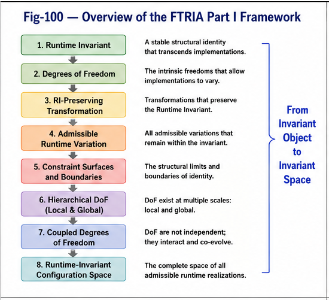

# Function Tunnel Runtime Invariant Algebra (FTRIA)

## From Runtime Invariant Geometry to Runtime Invariant Algebra

---

## Vision

Many successful algorithms in software engineering, Artificial Intelligence, and Structural Intelligence appear fundamentally different.

Transformer Attention, Common Concept Core (CCC), Differential Trees, Calling Graphs, Function Tunnels, Runtime Migration, Fine-Tuning, and numerous other systems are usually studied independently.

FTRIA proposes a different perspective.

Rather than beginning with algorithms, FTRIA begins with a common mathematical object:

> **The Runtime Invariant.**

A Runtime Invariant is a structural entity that preserves its identity while admitting multiple runtime realizations.

Once Runtime Invariants become explicit mathematical objects, many previously independent algorithms can be interpreted as different Runtime Operations acting upon the same underlying structures.

FTRIA therefore seeks to establish a common mathematical language for Runtime Intelligence.

---

# Repository Structure

## Part I — Runtime Invariant Geometry

---


---


---



---

Part I establishes the geometric foundations of Runtime Invariants.

Topics include

* Runtime Invariant Degrees of Freedom
* RI-Preserving Transformation
* Admissible Runtime Variation
* Constraint Surfaces
* Local and Global Degrees of Freedom
* Coupled Degrees of Freedom
* Runtime Invariant Configuration Space

The central question is:

> **What is a Runtime Invariant, and what is its admissible Runtime Space?**

---

## Part II — Runtime Invariant Algebra

Part II establishes the operational mathematics of Runtime Invariants.

Three major Runtime Algebras are introduced.

### Runtime Invariant Discovery

How Runtime Invariants are discovered from observations.

Representative topics include

* Runtime Invariant Discovery
* Common Concept Core (CCC)
* Runtime Alignment
* Runtime Structural Organization
* Runtime Invariant Discovery Pipeline
* Transformer Embeddings
* Transformer Attention

---

### Runtime Invariant Extension

How Runtime Invariants evolve while preserving structural identity.

Representative topics include

* RI-Preserving Transformation
* Runtime Invariant Extension
* Structural Generalization
* Future mappings to CCC Preserve Generation, Fine-Tuning, LoRA, PEFT, Runtime Migration, and related techniques

---

### Runtime Invariant Triggering

How Runtime Invariants become active during execution.

Representative topics include

* Runtime Trigger Algebra
* Runtime Context
* Runtime Activation
* Calling Graphs
* Function Tunnels
* Agent Runtime
* Transformer Runtime

---

# Runtime Invariant Lifecycle

The Runtime Algebra proposed by FTRIA describes the lifecycle of Runtime Invariants.

```text
Discovery

↓

Runtime Invariant

↓

Extension

↓

Triggering

↓

Runtime Execution

↓

Runtime Evolution
```

This lifecycle serves as a common conceptual framework for symbolic AI, neural AI, software engineering, and future Runtime Engineering.

---

# Runtime Organization Ladder

Engineering experience suggests that Runtime Invariants emerge progressively through structural organization.

```text
Matching

↓

Runtime Alignment

↓

Runtime Structural Organization

↓

Runtime Invariant

↓

Runtime Triggering

↓

Runtime Evolution
```

This ladder represents the constructive process by which Runtime Intelligence is gradually formed.

---

# Working Hypotheses

FTRIA also proposes several forward-looking research hypotheses.

These include

* Runtime Operator Economy
* From Implicit Runtime Intelligence to Explicit Runtime Algebra
* From Runtime Alignment to Runtime Structural Organization

These hypotheses are intentionally presented as research directions rather than established scientific conclusions.

---

# Figures

The repository figures are organized as shared Runtime Assets.

Core figures include

* Runtime Invariant Geometry
* Runtime Invariant Configuration Space
* Runtime Invariant Discovery Pipeline
* Runtime Structural Organization
* Runtime Invariant Lifecycle
* Three Runtime Algebras

Individual papers reference these shared figures through cross-links rather than duplicating illustrations.

---

# Current Scope (Version 1.0)

Version 1.0 establishes the conceptual foundations of

* Runtime Invariant Geometry
* Runtime Invariant Algebra
* Runtime Structural Organization
* Runtime Operator Economy

The objective of Version 1.0 is to establish a coherent mathematical framework rather than to comprehensively cover every existing algorithm.

---

# Future Releases

Future versions will progressively map existing algorithms into the Runtime Invariant Algebra.

Planned topics include

* CCC Preserve Generation
* CCC Preserve Coding
* Dilution and Delution
* Gap Bridging
* Calling Graph Algebra
* Function Tunnel Algebra
* Transformer Runtime Triggering
* Fine-Tuning
* LoRA
* PEFT
* Runtime Mathematics
* Runtime Engineering

The long-term vision is not to replace existing algorithms, but to provide a unified Runtime mathematical framework within which they can be understood, compared, and further developed.

---

# Perspective

FTRIA proposes that Runtime Invariants represent a useful mathematical abstraction for understanding Runtime Intelligence.

Whether future research confirms, revises, or extends this framework remains an open scientific question.

Our goal is therefore not to conclude the study of Runtime Intelligence, but to provide a common language through which future discoveries can be more naturally connected.

---

## Citation

If this repository contributes to your research, please consider citing it using the provided **CITATION.cff** file or the associated Zenodo DOI.

---

**Sizhe Tan & GPT-Obot**

*Function Tunnel Runtime Invariant Algebra (FTRIA)*

*Building a common mathematical language for Runtime Intelligence.*


---

## Author

Sizhe Tan\
Independent Researcher

GPT-Obot\
AI Research Assistant

2026

## Citation

DOI: TBD

## License

Apache-2.0

---

## 📚 DBM-SI Series Navigation

See:\
[./docs/DBM-SI-Series-of-gitHub-Repositories/DBM-SI-Series-of-gitHub-Repositories.md](./docs/DBM-SI-Series-of-gitHub-Repositories/DBM-SI-Series-of-gitHub-Repositories.md)

[./docs/DBM-SI-Series-of-gitHub-Repositories/DBM-SI-Structural-Intelligence-Dictionary-(v2).md](./docs/DBM-SI-Series-of-gitHub-Repositories/DBM-SI-Structural-Intelligence-Dictionary-(v2).md)

