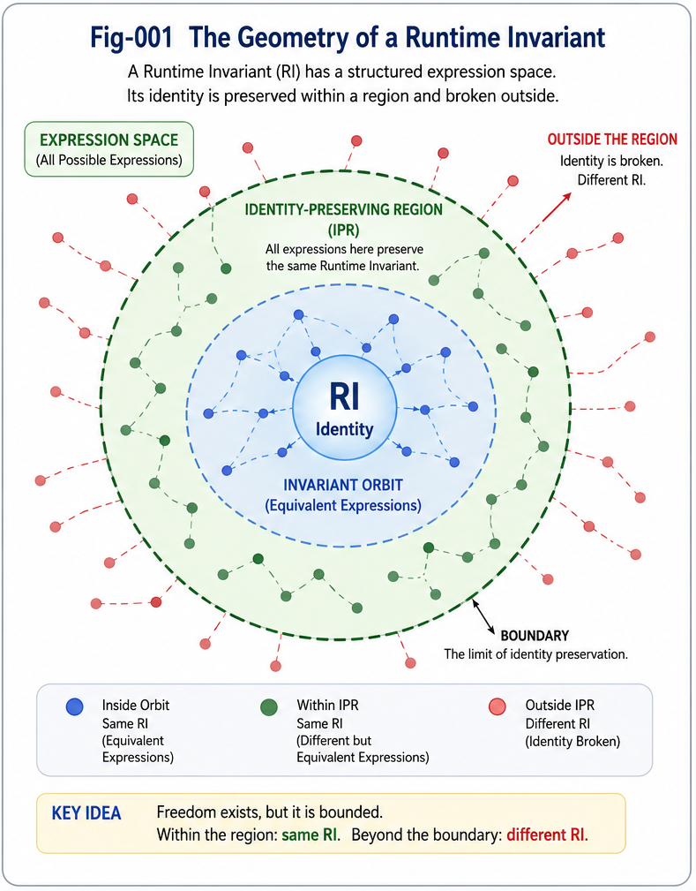
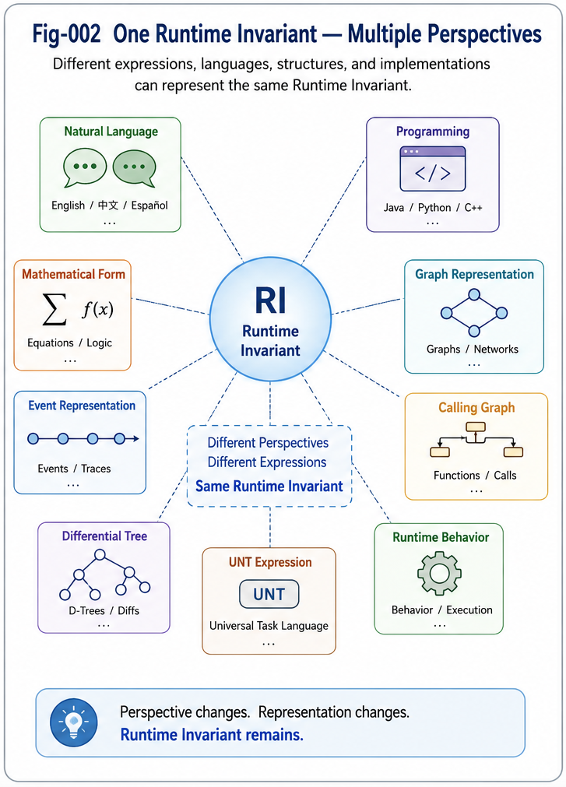

# FTRIA-001 — Runtime Invariant Degrees of Freedom
## Expression Families, Invariant Orbits, and Identity-Preserving Regions

**Function Tunnel and Runtime Invariant Algebra (FTRIA)**

**For FTRIA Part I — Foundations of Runtime-Invariant Degrees of Freedom**

---

## Abstract

Runtime Invariants (RIs) were introduced to describe the structural identities that remain unchanged across different runtime representations, perspectives, languages, implementations, or execution environments. Previous work focused primarily on identifying and preserving these invariants. This paper extends the theory by introducing the concept of **Runtime Invariant Degrees of Freedom (RI-DoF)**.

Instead of asking *what a Runtime Invariant is*, we ask a more fundamental question:

> **How much can a Runtime Invariant change while remaining the same Runtime Invariant?**

This shift transforms Runtime Invariants from isolated structural objects into members of structured expression spaces. It introduces the concepts of **Expression Families**, **Invariant Orbits**, and **Identity-Preserving Regions**, providing the first step toward a unified Runtime Algebra.

---



---

# 1. Introduction

Every Runtime Invariant possesses two complementary aspects.

The first is its **structural identity**, which must remain unchanged.

The second is the collection of all valid expressions that preserve this identity.

Traditional studies emphasize only the first aspect.

This work focuses on the second.

We argue that every Runtime Invariant naturally defines a structured expression space whose geometry determines the flexibility, robustness, and transformability of the invariant itself.

Consequently, Runtime Invariants should be understood not only as structural objects but also as centers of admissible transformation spaces.

---

# 2. Runtime Invariants Beyond Representation

A Runtime Invariant should not be confused with any particular representation.

Instead,

```
Runtime Invariant
        │
        ├── Language A
        ├── Language B
        ├── Graph
        ├── Code
        ├── Event
        ├── Mathematical Form
        └── Runtime Behavior
```

Every representation is merely a projection of the same underlying Runtime Invariant.

Therefore,

> **Representations change. Runtime Invariants remain.**

---



---

# 3. Expression Families

For a Runtime Invariant **R**, define

```
ExpressionFamily(R)
```

as the collection of every valid expression that preserves the identity of **R**.

Examples include

- multilingual expressions of the same semantic content,
- equivalent implementations in different programming languages,
- different Calling Graph realizations,
- structurally equivalent Differential Trees,
- multiple legal execution sequences,
- different user interfaces implementing the same runtime behavior.

Expression Families describe *how* one Runtime Invariant may legitimately appear without changing its identity.

---

# 4. Runtime Invariant Degrees of Freedom

The size and geometry of an Expression Family determine the Runtime Invariant's degree of freedom.

Conceptually,

```
RI Degree of Freedom

=

the admissible transformation space
that preserves one Runtime Invariant.
```

Some Runtime Invariants possess extremely small expression spaces.

Examples include

- fixed numerical values,
- exact binary encodings,
- cryptographic keys.

Others possess extremely rich expression spaces.

Examples include

- natural language semantics,
- software architectures,
- scientific explanations,
- educational presentations.

The larger the expression family, the greater the structural freedom of the Runtime Invariant.

---

# 5. Invariant Orbits

The collection of all equivalent expressions naturally forms what we call an **Invariant Orbit**.

```
                 Expression

            ○      ○      ○

        ○        RI        ○

            ○      ○      ○
```

Every point inside the orbit preserves the same Runtime Invariant.

Moving within the orbit changes only the representation.

Leaving the orbit changes the Runtime Invariant itself.

Invariant Orbits therefore define the natural geometry surrounding every Runtime Invariant.

---

# 6. Identity-Preserving Regions

Expression spaces are not infinite.

Every Runtime Invariant possesses boundaries.

We define the **Identity-Preserving Region (IPR)** as

> the maximal transformation region inside which every expression still represents the same Runtime Invariant.

Outside this region,

structural identity changes.

Consequently,

```
Transformation

↓

Identity-Preserving Region

↓

Same Runtime Invariant

↓

Boundary Crossing

↓

Different Runtime Invariant
```

Identity-Preserving Regions establish the structural boundaries of Runtime Algebra.

---

# 7. Relationship to Common Concept Cores (CCC)

A Common Concept Core (CCC) may be understood as a simplified Runtime Invariant.

```
Runtime Invariant
        │
        └── Simplified Runtime Invariant
                    │
                    └── CCC
```

Consequently,

CCC-Preserve Generation,

Dilution,

Delution,

and related structural transformation algorithms can all be interpreted as operations performed inside Runtime Invariant expression spaces.

This observation unifies numerous existing algorithms under the Runtime Algebra framework.

---

# 8. Static and Dynamic Runtime Invariants

This work studies Runtime Invariants as static structural identities.

The next step extends the theory into dynamic systems.

```
Runtime Invariant

↓

Runtime Invariant Sequence

↓

Function Tunnel

↓

Function Tunnel Network
```

Under this perspective,

Function Tunnels become ordered Runtime Invariant sequences,

providing the bridge between static identity and dynamic computation.

---

# 9. Toward Runtime Algebra

The concepts introduced here constitute the first building block of Function Tunnel and Runtime Invariant Algebra (FTRIA).

Rather than studying isolated runtime objects,

FTRIA studies

- Runtime Invariants,
- their admissible transformation spaces,
- structural equivalence,
- identity-preserving operations,
- Runtime Invariant sequences,
- and the algebra governing their evolution.

This establishes a unified mathematical foundation connecting Runtime Invariants, Function Tunnels, Calling Graphs, Differential Trees, Universal Task Language, and future Runtime Architectures.

---

# Key Takeaways

- Runtime Invariants possess both structural identities and admissible expression spaces.
- Expression Families characterize all valid representations preserving one Runtime Invariant.
- Runtime Invariant Degrees of Freedom measure the flexibility of these expression spaces.
- Invariant Orbits organize equivalent expressions around one Runtime Invariant.
- Identity-Preserving Regions define the structural boundaries of Runtime identity.
- Common Concept Cores (CCC) can be interpreted as simplified Runtime Invariants.
- Function Tunnels may be understood as ordered Runtime Invariant sequences.
- These concepts form the first theoretical foundation of Function Tunnel and Runtime Invariant Algebra (FTRIA).

---

## Relation to the FTRIA Series

This paper establishes the conceptual foundation of Runtime Invariant freedom.

Subsequent papers will introduce

- Runtime Invariant Equivalence,
- Runtime Invariant Attributes,
- Runtime Algebra Operations,
- Runtime Invariant Sequences,
- Function Tunnel Algebra,
- Dynamic Runtime Algebra,
- and unified Runtime structural mathematics.

Together, these studies aim to establish Function Tunnel and Runtime Invariant Algebra as a unified mathematical framework for Structural Intelligence.