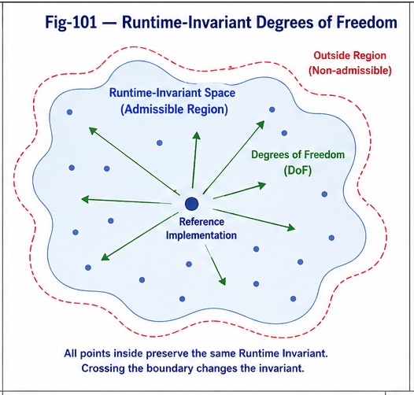
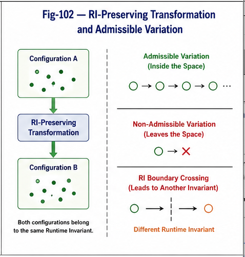
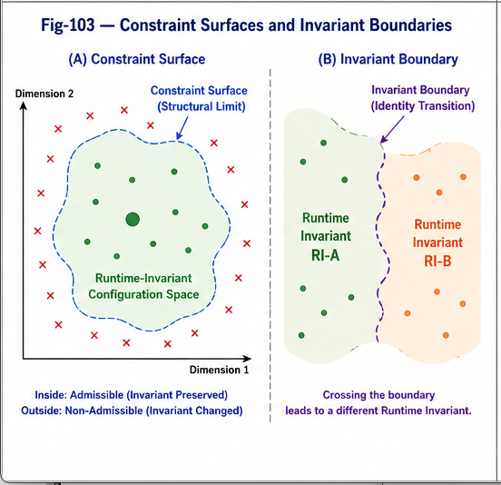
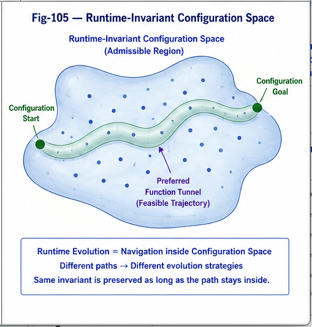

# FTRIA-003 — Admissible Runtime Variation

**Part I — Foundations of Runtime-Invariant Degrees of Freedom**

---

## Abstract

Runtime Invariants permit variation.

However,

they do not permit arbitrary variation.

Every Runtime Invariant possesses a finite region within which implementations may evolve while preserving the invariant.

This paper introduces the concept of **Admissible Runtime Variation (ARV)**—the set of implementation variations that preserve Runtime Invariant identity.

Rather than asking whether two implementations are identical,

FTRIA asks a different question:

> **Does this variation remain inside the admissible region of the Runtime Invariant?**

This shift transforms software evolution from implementation comparison into structural feasibility analysis.

---



---



---



---



---

# 1. Variation Is a Fundamental Property of Runtime Systems

No practical runtime remains completely static.

Real systems continuously experience

- optimization,
- refactoring,
- scheduling,
- migration,
- adaptation,
- scaling,
- hardware replacement,
- distributed deployment,
- compiler evolution.

Variation is therefore unavoidable.

The important question is not whether variation occurs,

but whether the variation preserves the Runtime Invariant.

---

# 2. Not Every Variation Is Admissible

Two categories of runtime variation exist.

```
Runtime Variation

├── Admissible
│      RI preserved
│
└── Non-admissible
       RI changed
```

Admissible variation remains inside the Runtime Invariant.

Non-admissible variation crosses the invariant boundary and produces a different Runtime Invariant.

This distinction is structural rather than syntactic.

---

# 3. Admissible Runtime Variation

An admissible variation satisfies two conditions.

First,

the implementation changes.

Second,

the Runtime Invariant remains unchanged.

Examples include

- implementation replacement,
- module decomposition,
- function merging,
- execution scheduling,
- compiler optimization,
- cache optimization,
- runtime migration,
- parallel execution,
- hardware adaptation,
- semantic-preserving translation.

Each implementation may look substantially different,

yet all realize the same Runtime Invariant.

---

# 4. Structural Capability Is the Criterion

Admissibility should not be judged by

- source-code similarity,
- syntax,
- parameter values,
- execution order,
- programming language.

Instead,

the determining factor is structural capability.

If the Runtime Invariant continues to provide the same structural capability,

the variation remains admissible.

Therefore,

admissibility is fundamentally a structural property.

---

# 5. Runtime Variation Space

Every Runtime Invariant owns a variation space.

```
              Admissible Region

        ○   ○   ○   ○

     ○               ○

   ○        ●          ○

     ○               ○

        ○   ○   ○   ○
```

The center represents the Runtime Invariant.

Every surrounding point represents a valid implementation.

Movement inside this region preserves the Runtime Invariant.

Movement beyond the region creates another Runtime Invariant.

The boundary therefore separates identity preservation from identity transition.

---

# 6. Why Admissible Variation Matters

Understanding admissible variation immediately simplifies many engineering problems.

Instead of asking

"Can this implementation be modified?"

we ask

"Does the modification remain inside the admissible region?"

Likewise,

migration,

optimization,

translation,

compression,

and refactoring

can all be interpreted as searches for admissible runtime variations.

This provides a unified framework for software evolution.

---

# 7. Relationship to Previous FTRIA Principles

The previous paper introduced RI-Preserving Transformations.

Admissible Runtime Variation extends this idea.

Every RI-preserving transformation generates an admissible variation.

Conversely,

every admissible variation can be interpreted as one or more RI-preserving transformations.

Therefore,

RI-preserving transformations describe **how** implementations move,

while admissible variation defines **where** they are allowed to move.

Together,

they establish the geometric foundation of Runtime Invariant Degrees of Freedom.

---

# 8. Toward Constraint Geometry

Once admissible variation is defined,

the remaining problem becomes identifying the limits of admissibility.

This naturally leads to

- Runtime Constraint Surfaces,
- Runtime Boundaries,
- Structural Stability Regions,
- Runtime Configuration Spaces.

These concepts form the next layer of the Function Tunnel Runtime Invariant Architecture.

---

# Key Takeaways

- Runtime systems inevitably evolve through variation.
- Only a subset of variations preserves Runtime Invariant identity.
- Admissible Runtime Variation defines the allowable implementation space of a Runtime Invariant.
- Structural capability, rather than implementation similarity, determines admissibility.
- RI-preserving transformations generate admissible runtime variations.
- Admissible variation provides the foundation for runtime constraint geometry and future Runtime Algebra.

---

## Related FTRIA Documents

- **FTRIA-001 — Runtime Invariant Degrees of Freedom**
- **FTRIA-002 — RI-Preserving Transformation**
- **FTRIA-004 — Constraint Surfaces and Invariant Boundaries**
- **FTRIA-005 — Local and Global Degrees of Freedom**