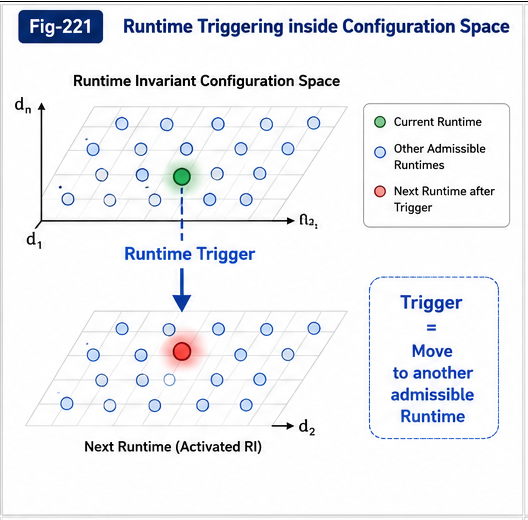

# FTRIA-007 — Runtime-Invariant Configuration Space

**Part I — Foundations of Runtime-Invariant Degrees of Freedom**

---

## Abstract

Previous papers established that Runtime Invariants possess Degrees of Freedom governed by admissible variation, structural constraints, and coupled interactions.

Taken together, these concepts imply that a Runtime Invariant should no longer be viewed as a single implementation.

Instead,

it should be understood as an entire **Configuration Space** containing all admissible runtime realizations.

This paper introduces the concept of the **Runtime-Invariant Configuration Space (RICS)**.

Rather than representing one executable program,

a Runtime Invariant represents a structured region within which multiple implementations coexist while preserving the same structural identity.

The Runtime-Invariant Configuration Space provides the geometric foundation upon which future Runtime Geometry, Runtime Dynamics, Runtime Optimization, and Runtime Algebra may be constructed.

---


---


---


---



---

# 1. From Individual Implementations to Configuration Spaces

Traditional software engineering often associates one implementation with one program.

FTRIA adopts a different perspective.

A Runtime Invariant is not represented by one implementation.

Instead,

it corresponds to an entire collection of admissible implementations.

Consequently,

the Runtime Invariant should be regarded as a configuration space rather than a single runtime instance.

---

# 2. Definition of Runtime-Invariant Configuration Space

A **Runtime-Invariant Configuration Space (RICS)** is the complete set of runtime configurations that preserve the identity of a Runtime Invariant.

Conceptually,

```
          Runtime-Invariant
        Configuration Space

        ○ ○ ○ ○ ○ ○

     ○               ○

   ○       RI         ○

     ○               ○

        ○ ○ ○ ○ ○ ○
```

Every point inside the space represents a valid runtime realization.

All realizations preserve the same Runtime Invariant.

The Runtime Invariant therefore characterizes the entire space rather than any individual point.

---

# 3. Dimensions of Configuration Space

Different Runtime Invariants possess different configuration dimensions.

Possible dimensions include

- implementation choices,
- Calling Graph organization,
- module composition,
- execution scheduling,
- resource allocation,
- deployment topology,
- optimization strategies,
- hardware mappings,
- runtime packaging,
- semantic representations.

Each admissible dimension contributes to the overall Degrees of Freedom of the Runtime Invariant.

---

# 4. Constraint Surfaces Shape Configuration Spaces

The Runtime-Invariant Configuration Space is not unrestricted.

Constraint Surfaces define its admissible region.

Invariant Boundaries define its limits.

Consequently,

Configuration Spaces possess shape,

structure,

and topology.

Different Runtime Invariants therefore possess different geometric structures.

Some spaces may be compact.

Others may contain disconnected admissible regions.

Some may exhibit narrow Function Tunnels connecting distant configurations.

---

# 5. Navigation Within Configuration Space

Runtime evolution can now be interpreted as navigation inside the Runtime-Invariant Configuration Space.

Typical runtime operations become

- optimization,
- migration,
- refactoring,
- compiler transformation,
- deployment,
- scheduling,
- runtime adaptation.

Each operation corresponds to movement from one admissible configuration to another.

As long as movement remains inside the Configuration Space,

the Runtime Invariant is preserved.

Crossing the Invariant Boundary produces a different Runtime Invariant.

---

# 6. Configuration Spaces Are Hierarchical

Configuration Spaces naturally inherit the hierarchical organization established in previous papers.

Local Configuration Spaces describe admissible variation within localized runtime structures.

Global Configuration Spaces describe admissible variation of the Runtime Invariant as a whole.

These spaces are connected through coupled Degrees of Freedom.

Consequently,

Runtime systems form hierarchically organized Configuration Spaces rather than a single flat space.

---

# 7. Function Tunnels Inside Configuration Spaces

Not every path inside a Configuration Space is equally practical.

Many Runtime Invariants exhibit preferred regions where evolution is easier, more stable, or computationally efficient.

These regions naturally form **Function Tunnels**.

Function Tunnels therefore represent feasible trajectories through the Runtime-Invariant Configuration Space.

This interpretation establishes a direct connection between FTRIA and the broader Function Tunnel framework developed throughout the Structural Intelligence program.

---

# 8. Toward Runtime Geometry and Runtime Algebra

Once Runtime-Invariant Configuration Spaces are established,

many higher-level mathematical structures become possible.

These include

- Runtime Geometry,
- Runtime Dynamics,
- Configuration Space Topology,
- Structural Stability Analysis,
- Runtime Optimization,
- Runtime Migration Theory,
- Runtime Algebra.

In this view,

software engineering evolves from manipulating implementations to navigating structured configuration spaces governed by Runtime Invariants.

---

# Key Takeaways

- A Runtime Invariant represents an entire Configuration Space rather than a single implementation.
- Every admissible runtime realization corresponds to a point inside the Runtime-Invariant Configuration Space.
- Constraint Surfaces and Invariant Boundaries determine the shape of the Configuration Space.
- Runtime evolution can be interpreted as navigation within Configuration Space.
- Function Tunnels correspond to preferred feasible trajectories inside Configuration Spaces.
- Runtime-Invariant Configuration Spaces provide the geometric foundation for future Runtime Geometry, Runtime Dynamics, and Runtime Algebra.

---

## Related FTRIA Documents

- **FTRIA-001 — Runtime Invariant Degrees of Freedom**
- **FTRIA-002 — RI-Preserving Transformation**
- **FTRIA-003 — Admissible Runtime Variation**
- **FTRIA-004 — Constraint Surfaces and Invariant Boundaries**
- **FTRIA-005 — Local and Global Degrees of Freedom**
- **FTRIA-006 — Coupled Degrees of Freedom**