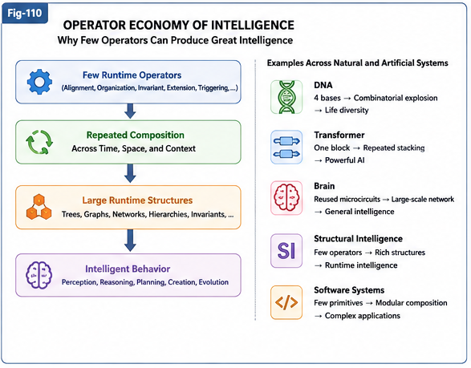

# FTRIA-118 — Operator Economy of Intelligence

**Part II — Runtime Invariant Algebra**

---

# Abstract

One of the most remarkable observations across natural and artificial intelligence is that extraordinary complexity often emerges from surprisingly small collections of reusable computational mechanisms.

DNA builds biological diversity using four nucleotide bases.

Modern software systems are constructed from relatively few programming primitives.

Transformer architectures repeatedly reuse nearly identical computational blocks.

Structural Intelligence likewise suggests that Runtime Invariant Discovery, Extension, and Triggering may be implemented through a relatively small family of highly reusable Runtime Operators.

This paper proposes the **Principle of Runtime Operator Economy** as a working hypothesis.

Rather than assuming that increasing intelligence necessarily requires increasingly numerous fundamental operators, this principle suggests that intelligent systems may derive their expressive power primarily from repeated composition, organization, and reuse of a comparatively small Runtime Operator set.

---

---

---

# 1. Complexity from Simplicity

Throughout science,

high-level complexity frequently arises from relatively simple underlying principles.

Examples include

- molecular biology,
- classical mechanics,
- software engineering,
- distributed systems,
- neural networks.

In each case,

large-scale complexity emerges through repeated combinations of comparatively simple building blocks.

This recurring observation motivates a similar question for Runtime Intelligence.

> Could intelligent behavior likewise emerge from a relatively small collection of Runtime Operators?

---

# 2. Runtime Operator Economy

The Principle of Runtime Operator Economy proposes the following hypothesis.

> Advanced intelligent systems may derive most of their expressive capability not from an ever-growing collection of fundamentally different operators, but from repeated organization and composition of a relatively small number of highly reusable Runtime Operators.

Under this view,

increasing intelligence depends primarily upon

- richer Runtime Structures,
- improved structural organization,
- larger Runtime Configuration Spaces,
- more effective Runtime Invariant reuse,

rather than continual invention of entirely new primitive operators.

---

# 3. Evidence Across Artificial Intelligence

Several successful AI systems exhibit this characteristic.

**Transformer-based AI**

A single Transformer block is repeated many times.

Capability grows primarily through repeated composition rather than fundamentally new computational primitives.

**Structural Intelligence**

Runtime Alignment,

Runtime Structural Organization,

Runtime Invariant Discovery,

Runtime Extension,

and Runtime Triggering repeatedly appear across images,

graphs,

sequences,

knowledge systems,

and software structures.

Different applications reuse similar Runtime Operators.

**Software Engineering**

Large software ecosystems are constructed from relatively few computational primitives,

reused through modular organization.

---

# 4. Evidence from Biological Systems

Biological systems also suggest remarkable operator reuse.

Examples include

- repeated cortical microcircuits,
- hierarchical organization,
- reusable sensorimotor structures,
- recursive developmental processes.

Although the exact computational mechanisms remain an active area of research,

biology repeatedly demonstrates that extensive behavioral diversity may emerge from repeated reuse of relatively simple structural components.

Whether biological intelligence implements Runtime Operators analogous to those proposed in FTRIA remains an open scientific question.

---

# 5. Runtime Operators versus Runtime Structures

Runtime Operator Economy distinguishes between two different sources of complexity.

**Runtime Operators**

perform transformations.

Examples include

- Runtime Alignment,
- Structural Organization,
- Runtime Invariant Discovery,
- Runtime Extension,
- Runtime Triggering.

**Runtime Structures**

store accumulated organization.

Examples include

- Differential Trees,
- Universal Task Networks,
- Calling Graphs,
- Runtime Graphs,
- Runtime Invariants.

The hypothesis suggests that structural richness may grow much faster than operator diversity.

Consequently,

complex intelligence may emerge primarily from increasingly sophisticated Runtime Structures operated upon by a relatively small Runtime Operator family.

---

# 6. Engineering Implications

Operator Economy suggests several engineering principles.

Rather than continually introducing new primitive algorithms,

future AI systems may benefit more from

- reusable Runtime Operators,
- improved structural organization,
- richer Runtime Configuration Spaces,
- modular Runtime Architectures,
- explicit Runtime Invariant Engineering.

This perspective favors systematic reuse over uncontrolled algorithmic proliferation.

---

# 7. Scientific Position

The Principle of Runtime Operator Economy is proposed as a research hypothesis.

Current evidence from biology,

software engineering,

and artificial intelligence appears consistent with this perspective,

but it does not yet establish it as a universal law.

Future empirical research,

theoretical analysis,

and neuroscience may refine,

extend,

or revise this principle.

Its primary purpose is to encourage investigation into the possibility that intelligent systems derive much of their power from a surprisingly small collection of highly reusable Runtime Operators.

---

# Key Takeaways

- Runtime Operator Economy proposes that intelligent systems may rely upon relatively few highly reusable Runtime Operators.
- Structural richness may increase primarily through organization and composition rather than continual invention of new primitive operators.
- Transformer architectures, Structural Intelligence, and software engineering all exhibit significant operator reuse.
- Runtime Structures and Runtime Operators represent complementary sources of intelligent capability.
- Operator Economy favors reusable Runtime Architectures and explicit Runtime Engineering.
- The Principle of Runtime Operator Economy is presented as a working hypothesis for future research rather than an established scientific conclusion.

---

## Related FTRIA Documents

**Discovery Algebra**

- FTRIA-109 — Runtime Invariant Discovery Pipeline
- FTRIA-117 — Runtime Structural Organization Operators

**Extension & Triggering**

- FTRIA-110 — Runtime Invariant Extension Algebra
- FTRIA-120 — Runtime Invariant Trigger Algebra

**Outlook**

- FTRIA-190 — From Implicit Runtime Intelligence to Explicit Runtime Algebra
- FTRIA-191 — From Runtime Alignment to Runtime Structural Organization