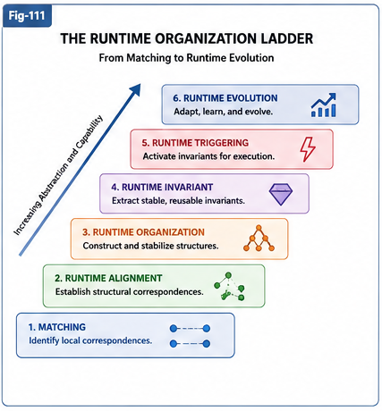

# FTRIA-193 — The Runtime Organization Ladder as an AI Evolution Map

**Future Directions**

---

# Abstract

Artificial Intelligence is commonly described through successive generations of models such as CNNs, Transformers, Large Language Models, and AI Agents.

This paper proposes a complementary perspective.

Instead of classifying AI systems by architecture, we classify them by the **Runtime capability** they primarily amplify.

Based on the Runtime Organization Ladder developed in FTRIA, we suggest that much of AI history can be interpreted as the progressive amplification of increasingly higher Runtime Operators.

Although this interpretation remains a research hypothesis, it provides a unified framework for understanding past breakthroughs while offering possible guidance for future AI development.

---



---

# 1. A Runtime-Centered Perspective

AI systems are often grouped according to their implementation.

Examples include

* Convolutional Neural Networks,
* Transformers,
* Large Language Models,
* AI Agents,
* World Models.

While useful,

this taxonomy says relatively little about the Runtime capabilities these systems primarily enhance.

FTRIA instead asks a different question.

> **Which Runtime Operator has been dramatically amplified by each generation of AI?**

---

# 2. The Runtime Organization Ladder

The Runtime Organization Ladder provides one possible answer.

```text
Matching

↓

Runtime Alignment

↓

Runtime Structural Organization

↓

Runtime Invariant

↓

Runtime Triggering

↓

Runtime Evolution
```

Rather than representing isolated algorithms,

this ladder describes progressively higher levels of Runtime capability.

Each level builds naturally upon the previous one.

---

# 3. The Matching Era

Many early AI systems primarily amplified Matching.

Examples include

* feature matching,
* template matching,
* nearest-neighbor retrieval,
* local correspondence estimation.

These systems achieved remarkable success,

yet remained largely limited to local structural relationships.

---

# 4. The Alignment Revolution

Transformer architectures and Large Language Models introduced a dramatic increase in Runtime Alignment capability.

Attention mechanisms continuously establish context-dependent structural correspondences among tokens.

Embedding spaces provide stable alignment across words,

phrases,

sentences,

code,

and increasingly,

multimodal representations.

From the perspective of FTRIA,

the Transformer revolution may therefore be interpreted as a **Runtime Alignment Revolution**.

Language itself is the application domain.

Alignment is the computational breakthrough.

---

# 5. The Next Frontier: Runtime Structural Organization

Alignment alone does not construct large reusable Runtime Structures.

Many future intelligent systems will likely require the ability to organize observations into

* Differential Trees,
* Universal Task Networks,
* Calling Graphs,
* Runtime Graphs,
* reusable structural knowledge,
* Brain Units,
* long-term computational assets.

This capability extends beyond correspondence.

It requires Runtime Structural Organization.

Consequently,

Runtime Structural Organization may represent the next major opportunity for broad AI advancement.

---

# 6. Beyond Organization

Higher levels of the Runtime Organization Ladder remain comparatively unexplored.

Runtime Invariants support

* abstraction,
* reuse,
* transfer,
* structural stability.

Runtime Triggering governs

* activation,
* planning,
* execution,
* scheduling,
* runtime adaptation.

Runtime Evolution continually reorganizes Runtime Structures through accumulated experience.

Each level represents a possible direction for future AI architectures.

---

# 7. A Possible Evolutionary Map

Conceptually,

the history and future of AI may be viewed as successive amplifications of Runtime capability.

```text
Matching

↓

Alignment

↓

Structural Organization

↓

Runtime Invariant

↓

Runtime Triggering

↓

Runtime Evolution
```

This ladder is not intended to predict exact technologies or timelines.

Instead,

it provides a conceptual coordinate system for discussing where future breakthroughs may occur.

---

# 8. A Research Hypothesis

This paper proposes the following working hypothesis.

> Future AI breakthroughs may arise not only from larger models or additional data, but from substantial improvements in progressively higher Runtime Operators.

Under this view,

the next transformative generation of AI may focus less on increasing parameter count and more on amplifying Runtime Structural Organization, Runtime Invariant Engineering, and Runtime Trigger Algebra.

Whether this hypothesis proves correct remains an open scientific question.

---

# Key Takeaways

* AI generations may be classified according to the Runtime capability they primarily amplify.
* Early AI largely strengthened Matching.
* Transformer-based LLMs may be interpreted as a major Runtime Alignment breakthrough.
* Runtime Structural Organization may represent the next important frontier for large-scale AI systems.
* Runtime Invariants, Runtime Triggering, and Runtime Evolution provide additional long-term directions for future AI research.
* The Runtime Organization Ladder offers a unified conceptual framework for interpreting both past and future developments in Artificial Intelligence.

---

## Perspective

Architectures change.

Models evolve.

Training methods improve.

Yet the underlying Runtime capabilities they amplify may follow a much slower and more coherent trajectory.

If the Runtime Organization Ladder continues to explain future AI advances, it may eventually serve not only as a theory of Runtime Intelligence, but also as a map of AI evolution itself.
