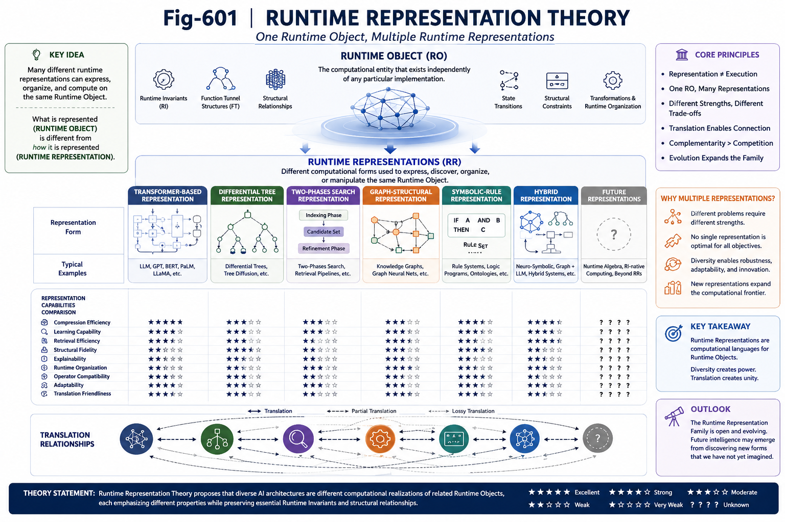

# GS-002 — Runtime Representation Theory

## Part VI — Grand Synthesis

---

# Abstract

Artificial Intelligence has historically been organized around algorithms, architectures, and implementation techniques. Neural networks, symbolic systems, search algorithms, graph computation, and structural methods are typically regarded as distinct computational paradigms.

This work proposes an alternative viewpoint.

Instead of organizing AI around algorithms, we propose organizing it around **Runtime Objects** and their **Runtime Representations**.

Under this perspective, multiple computational frameworks may represent different runtime realizations of related computational structures while employing entirely different execution mechanisms.

This theory provides a conceptual foundation for the AI Unified Computational Field.

---

---

# 1. From Algorithm-Centric AI to Runtime-Centric AI

Traditional AI classification is largely algorithm-oriented.

Examples include:

* Transformer
* CNN
* RNN
* Graph Neural Networks
* Rule Engines
* Search Algorithms
* Knowledge Graphs

Each category is usually treated as an independent computational framework.

This perspective has been highly successful for engineering development.

However, it does not necessarily describe the underlying computational objects being manipulated.

Runtime Representation Theory therefore asks a different question:

> What computational object is actually being represented?

---

# 2. Runtime Objects

A Runtime Object is the computational entity that persists across different implementations.

Examples may include:

* Runtime Invariants (RI)
* Function Tunnel structures
* Structural organizations
* Runtime state transitions
* Structural constraints
* Runtime transformation paths

A Runtime Object is not defined by a particular algorithm.

Rather, algorithms operate upon Runtime Objects through specific representations.

---

# 3. Runtime Representations

A Runtime Representation is a computational form that expresses, discovers, organizes, or manipulates Runtime Objects.

Different representations may emphasize different computational properties.

Examples include:

* statistical efficiency;
* structural transparency;
* runtime adaptability;
* retrieval efficiency;
* composability;
* explainability.

No single representation is expected to optimize every property simultaneously.

Different representations therefore serve complementary purposes.

---

# 4. One Object, Multiple Representations

Representation diversity is common throughout science.

A geometric object may be represented by:

* coordinates;
* equations;
* meshes;
* implicit surfaces.

The underlying object remains the same while the representations differ.

Runtime Representation Theory proposes that AI computation may exhibit a similar property.

A Runtime Object may admit multiple computational representations, each exposing different computational advantages.

This distinction separates:

**what is being computed**

from

**how it is represented.**

---

# 5. Representation Is Not Execution

One important distinction should be emphasized.

Runtime Representation does not determine Runtime Execution.

Two representations of related Runtime Objects may employ completely different computational mechanisms.

For example:

* gradient optimization;
* graph traversal;
* structural search;
* symbolic inference;
* runtime operators.

Execution mechanisms may differ substantially while still operating upon related Runtime Objects.

Representation Theory therefore does not imply computational equivalence.

Instead, it proposes structural correspondence.

---

# 6. Runtime Projection

Representations may be viewed as projections of Runtime Objects.

Each projection preserves certain structural properties while emphasizing particular computational characteristics.

Examples include:

* compactness;
* statistical regularity;
* structural locality;
* retrieval organization;
* execution efficiency;
* runtime adaptability.

Different projections need not preserve identical information.

Some may emphasize approximation.

Others may emphasize structural fidelity.

Projection therefore introduces engineering trade-offs rather than theoretical contradictions.

---

# 7. Representation Translation

If multiple representations exist, translation naturally becomes possible.

Potential translation directions include:

* neural → structural;
* structural → neural;
* search → runtime graph;
* runtime graph → symbolic representation.

Translation need not be perfectly reversible.

Instead, useful translation should preserve sufficient Runtime Invariants for the target computation.

Runtime Representation Theory therefore introduces a new research direction:

**Representation Translation**.

---

# 8. Representation Families

Rather than viewing AI architectures as isolated inventions, Runtime Representation Theory proposes organizing them into Representation Families.

A Representation Family consists of computational frameworks that manipulate related Runtime Objects through different runtime realizations.

Current examples may include:

* Transformer-based representations;
* Differential Tree representations;
* Two-Phases Search representations.

Future members may include entirely new runtime-native computational representations.

The Representation Family therefore remains open rather than fixed.

---

# 9. Representation Discovery

Historically, AI research has largely focused on improving existing representations.

Examples include:

* larger neural models;
* deeper architectures;
* more efficient attention mechanisms;
* improved optimization.

Runtime Representation Theory introduces another complementary research objective.

Rather than improving one representation alone, AI may increasingly seek to discover new runtime representations.

Representation Discovery therefore becomes a first-class research problem.

This naturally expands the search space of future AI.

---

# 10. Representation Hybridization

Multiple Runtime Representations need not compete.

Instead, they may cooperate.

Different representations may specialize in:

* learning;
* organization;
* retrieval;
* verification;
* structural reasoning;
* runtime adaptation.

Hybrid systems may therefore combine complementary strengths while preserving common Runtime Objects.

Representation Theory provides a conceptual language for describing such hybrid computation.

---

# 11. Representation Evaluation

Traditional AI evaluation often emphasizes prediction quality.

Runtime Representation Theory suggests additional evaluation dimensions.

Possible criteria include:

* representation completeness;
* structural fidelity;
* runtime explainability;
* translation capability;
* composability;
* operator compatibility;
* runtime migration capability;
* representation efficiency.

These metrics evaluate representations rather than individual algorithms.

---

# 12. Scope

Runtime Representation Theory intentionally avoids making overly broad claims.

It does not state that all AI architectures are mathematically equivalent.

It does not state that one representation should replace another.

Instead, it proposes a unifying conceptual framework for studying relationships among computational representations operating on related Runtime Objects.

The theory therefore complements rather than replaces existing computational paradigms.

---

# 13. Implications

Viewing AI through Runtime Representations naturally opens several research directions.

These include:

* Runtime Representation Discovery;
* Runtime Representation Translation;
* Runtime Representation Optimization;
* Runtime Representation Composition;
* Runtime Representation Certification;
* Runtime Representation Migration;
* Runtime Representation Algebra.

Together these directions form an emerging research landscape beyond individual architectures.

---

# Key Takeaways

* Runtime Objects are independent of any single implementation.
* Runtime Representations are computational realizations of Runtime Objects.
* Different representations emphasize different computational properties.
* Representation does not determine execution mechanism.
* Representation Translation enables communication across computational paradigms.
* Representation Discovery becomes a new research frontier.
* Representation Families provide a higher-level organization of AI architectures.
* Runtime Representation Theory forms one theoretical foundation of the AI Unified Computational Field.

---

## Relation to Part VI

GS-001 introduced the motivation for the AI Unified Computational Field.

This chapter establishes the theoretical language required to describe Runtime Objects, Runtime Representations, Representation Families, and Representation Translation.

Subsequent chapters examine how this perspective reshapes AI research strategy, engineering practice, and the future mathematics of structurally faithful computation.
