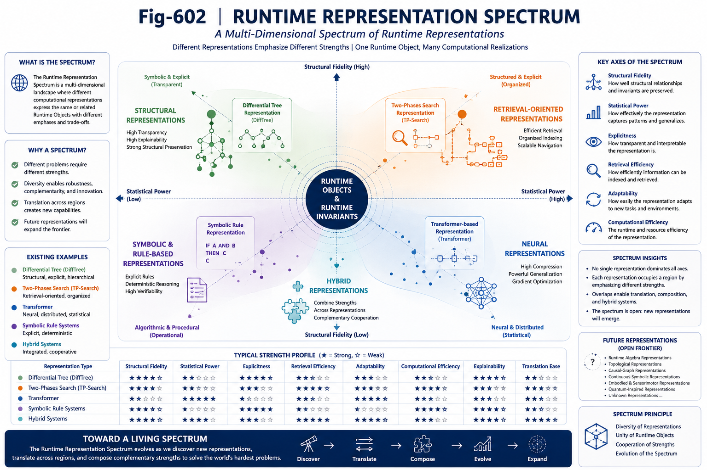

# GS-003 — The Runtime Representation Spectrum

## Part VI — Grand Synthesis

---

# Abstract

If Runtime Objects admit multiple Runtime Representations, then Artificial Intelligence should no longer be viewed as a collection of isolated algorithms.

Instead, AI may be understood as a spectrum of runtime representations, each emphasizing different computational properties while operating on related computational structures.

This work introduces the concept of the **Runtime Representation Spectrum**, providing a unified perspective for organizing existing AI architectures and discovering future computational representations.

---

---

# 1. From Algorithms to a Representation Spectrum

Artificial Intelligence has traditionally evolved through new algorithms.

Examples include:

* symbolic reasoning;
* neural networks;
* Transformer architectures;
* search algorithms;
* graph computation;
* structural methods.

These developments are usually presented as successive generations of AI.

Runtime Representation Theory suggests another interpretation.

Rather than representing entirely different kinds of intelligence, many of these systems may represent different computational realizations within a broader Runtime Representation Spectrum.

---

# 2. What Is a Representation Spectrum?

A Runtime Representation Spectrum is the collection of computational representations capable of expressing related Runtime Objects.

Each representation occupies a different region of the design space.

Different representations optimize different computational objectives.

Examples include:

* statistical efficiency;
* structural fidelity;
* learning capability;
* retrieval performance;
* runtime organization;
* explainability;
* operator composability;
* runtime adaptability.

No single representation is expected to dominate every dimension simultaneously.

---

# 3. Representative Regions of the Spectrum

The current AI landscape may already contain several representative regions.

## Neural Runtime Representations

Characteristics:

* distributed numerical encoding;
* gradient-based optimization;
* large-scale statistical generalization;
* excellent representation compression.

Typical examples include Transformer-based systems.

---

## Structural Runtime Representations

Characteristics:

* explicit structural organization;
* preserved structural relationships;
* high runtime transparency;
* strong explainability.

Representative examples include Differential Trees and related structural organizations.

---

## Retrieval-Oriented Runtime Representations

Characteristics:

* organized runtime indexing;
* efficient candidate generation;
* structured retrieval;
* scalable runtime navigation.

Representative examples include Two-Phases Search and related indexing systems.

---

## Hybrid Runtime Representations

Multiple representations may cooperate.

Examples include:

* neural learning with structural organization;
* structural reasoning with statistical prediction;
* retrieval-guided neural inference;
* runtime representation translation.

Hybrid representations naturally emerge as the spectrum expands.

---

# 4. Different Representations, Different Strengths

Every Runtime Representation emphasizes different computational capabilities.

Some representations excel at:

* learning;
* approximation;
* generalization.

Others emphasize:

* structural preservation;
* runtime organization;
* transparent reasoning;
* deterministic verification.

The Runtime Representation Spectrum therefore encourages complementarity rather than competition.

---

# 5. Representation Trade-Offs

Every representation introduces engineering trade-offs.

Possible trade-offs include:

* compression versus transparency;
* learning efficiency versus explainability;
* statistical flexibility versus structural fidelity;
* runtime adaptability versus deterministic execution.

Understanding these trade-offs becomes a central objective of Runtime Representation Theory.

---

# 6. Representation Translation

Representations need not remain isolated.

Translation allows Runtime Objects to move between different computational forms.

Possible examples include:

* neural representations translated into structural representations;
* structural representations translated into retrieval structures;
* retrieval structures guiding neural computation.

Translation enables cooperation across the Representation Spectrum.

---

# 7. Representation Composition

Translation is not the only relationship.

Representations may also compose.

Different representations may contribute different computational functions within the same runtime system.

For example:

* one representation performs large-scale learning;
* another organizes structural knowledge;
* another supports efficient retrieval;
* another verifies runtime consistency.

Composition creates computational ecosystems rather than isolated algorithms.

---

# 8. Beyond Today's Spectrum

The current spectrum should not be considered complete.

Future Runtime Representations may include:

* Runtime Algebra representations;
* Runtime-native computing;
* Runtime Invariant execution models;
* certified structural representations;
* adaptive runtime organizations;
* representations not yet imagined.

The spectrum therefore remains open.

Representation discovery becomes a continuous scientific process.

---

# 9. Implications for AI Research

Viewing AI through a Runtime Representation Spectrum changes several research priorities.

Instead of asking:

> Which representation will replace the others?

we may ask:

> Which representation is most appropriate for a given Runtime Object?

or

> Which combination of representations best serves the computational objective?

This shifts AI research toward representation ecology rather than architectural competition.

---

# 10. Toward Representation Ecology

The Runtime Representation Spectrum naturally leads to a broader computational ecosystem.

Representations coexist.

Representations cooperate.

Representations evolve.

Representations translate.

Representations specialize.

Collectively they form an adaptive Runtime Representation Ecology capable of supporting increasingly sophisticated runtime intelligence.

---

# Key Takeaways

* AI architectures may be organized as a Runtime Representation Spectrum.
* Different representations emphasize different computational strengths.
* Neural, structural, retrieval, and hybrid representations occupy complementary regions of the spectrum.
* Representation Translation enables cooperation across computational paradigms.
* Representation Composition enables heterogeneous runtime systems.
* Future Runtime Representations remain an open area of scientific discovery.
* The Runtime Representation Spectrum transforms AI from a collection of competing architectures into an evolving computational ecosystem.

---

## Relation to Part VI

GS-001 introduced the AI Unified Computational Field.

GS-002 established Runtime Representation Theory.

This chapter maps existing and future computational frameworks into a unified Runtime Representation Spectrum, providing the conceptual bridge from theoretical foundations toward engineering strategy and future AI architecture evolution.

The following chapter examines how this perspective reshapes current AI research, moving from representation lock-in toward systematic representation discovery.
