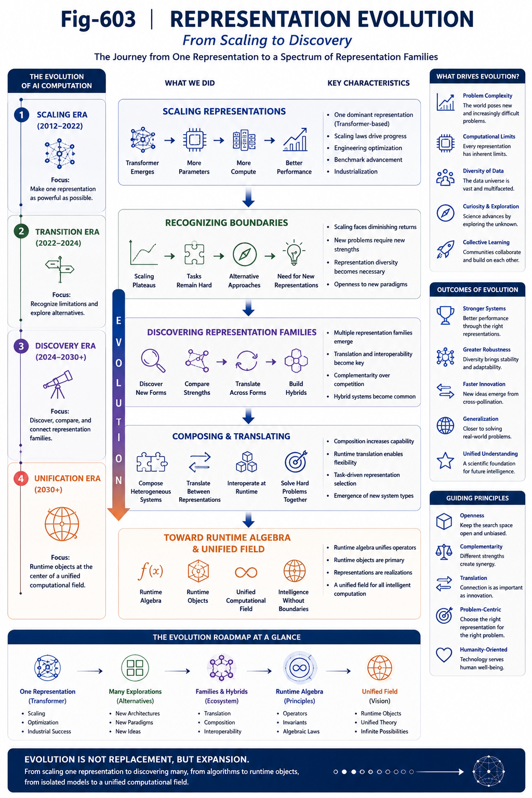

# GS-004 — Representation Evolution - From Scaling to Discovery

## Part VI — Grand Synthesis

---

# Abstract

The remarkable success of modern Artificial Intelligence has largely been driven by scaling increasingly capable Runtime Representations, particularly Transformer-based neural architectures.

This strategy has transformed AI and established one of the most successful engineering paradigms in computational history.

This work argues that Representation Scaling should be understood as one stage of a broader evolutionary process.

As Runtime Representation Theory matures, AI research may gradually expand beyond scaling existing representations toward systematically discovering, translating, composing, and optimizing entire families of Runtime Representations.

Representation Discovery therefore complements Representation Scaling rather than replacing it.

---

---

# 1. The Era of Representation Scaling

The past decade demonstrated an extraordinary engineering achievement.

Larger datasets.

Larger models.

Larger compute.

Improved optimization.

Better alignment.

Collectively these advances established a highly successful Runtime Representation capable of unprecedented generalization.

Representation Scaling should therefore be recognized as one of the defining achievements of modern AI.

Without it, many recent advances would not have been possible.

---

# 2. The Success That Shapes the Research Landscape

Scientific breakthroughs naturally influence future research directions.

When a computational representation consistently demonstrates strong empirical performance, research communities tend to concentrate around it.

This concentration produces:

* shared tooling;
* engineering ecosystems;
* benchmark progress;
* accumulated expertise;
* industrial investment.

Such concentration is a normal stage of technological evolution.

It accelerates progress and enables large-scale collaboration.

---

# 3. Representation Concentration and Its Boundaries

The success of one representation, however, does not by itself establish its uniqueness.

History repeatedly shows that highly successful engineering solutions often become the dominant representation for a period of time while alternative representations continue to emerge.

Representation Concentration therefore reflects engineering maturity rather than theoretical completeness.

Recognizing this distinction is important.

It allows future research to remain open without diminishing existing achievements.

---

# 4. From Scaling to Discovery

Representation Scaling asks:

> How can an existing Runtime Representation become more capable?

Representation Discovery asks:

> What additional Runtime Representations are possible?

These two questions are complementary.

Scaling deepens one representation.

Discovery broadens the representation landscape.

Both contribute to long-term scientific progress.

---

# 5. The Expansion of Research Degrees of Freedom

Once Runtime Representation Families are acknowledged, the design space naturally expands.

New research directions include:

* discovering new Runtime Representations;
* translating between representations;
* composing heterogeneous representations;
* evaluating representation fidelity;
* certifying runtime preservation;
* designing runtime-native representations.

The focus shifts from optimizing one computational language toward exploring an evolving computational ecosystem.

---

# 6. Representation Ecology

Future AI may increasingly resemble an ecological system rather than a single dominant architecture.

Different Runtime Representations may specialize in different computational roles.

Examples include:

* statistical learning;
* structural organization;
* efficient retrieval;
* runtime verification;
* symbolic reasoning;
* adaptive execution.

Rather than competing for universal dominance, representations may cooperate through Runtime Translation and Runtime Composition.

This perspective naturally leads to a Representation Ecology.

---

# 7. Engineering Implications

Representation Evolution suggests a broader engineering strategy.

Instead of building increasingly capable isolated architectures, future AI systems may integrate multiple complementary Runtime Representations.

Possible directions include:

* neural learning with structural organization;
* structural reasoning with statistical prediction;
* retrieval-guided inference;
* runtime representation migration;
* runtime operator composition.

Hybrid runtime systems become natural engineering outcomes.

---

# 8. Scientific Implications

Representation Evolution also reshapes theoretical research.

Important questions include:

* Which Runtime Objects admit multiple representations?
* What Runtime Invariants should be preserved?
* Which translations are information preserving?
* Which representations are complementary?
* How should representation quality be evaluated?

These questions extend AI research beyond architecture design toward Runtime Representation Science.

---

# 9. Representation Discovery as a Scientific Discipline

Representation Discovery should not be viewed as random exploration.

It requires systematic principles.

Possible foundations include:

* Runtime Representation Theory;
* Runtime Invariants;
* Function Tunnel structures;
* Runtime Algebra;
* structural preservation;
* representation translation.

Together these provide a scientific methodology for discovering future computational representations.

---

# 10. Beyond Scaling

Representation Scaling remains essential.

Future models will continue to become larger, faster, and more capable.

Representation Discovery introduces an additional dimension of progress.

Instead of asking only

> How large can one representation become?

AI research may increasingly ask

> What representations have not yet been discovered?

These two perspectives jointly define the future evolution of AI.

---

# 11. Toward an Open Computational Landscape

The long-term objective is not to identify a single universal architecture.

Instead, it is to understand the broader landscape of Runtime Representations capable of expressing intelligent computation.

This landscape remains largely unexplored.

Every newly discovered representation enriches the Runtime Representation Spectrum and expands the AI Unified Computational Field.

Representation Evolution therefore transforms AI from optimizing one representation into continuously discovering a family of computational languages.

---

# Key Takeaways

* Representation Scaling has been one of the greatest achievements in modern AI.
* Its success naturally concentrates scientific and engineering effort.
* Representation Concentration should not be confused with theoretical completeness.
* Representation Discovery complements rather than replaces Representation Scaling.
* Future AI may evolve through Runtime Representation Families rather than a single dominant representation.
* Representation Ecology provides a cooperative view of heterogeneous computational systems.
* Representation Evolution expands AI research from architecture optimization toward computational language discovery.

---

## Relation to Part VI

GS-001 introduced the AI Unified Computational Field.

GS-002 established Runtime Representation Theory.

GS-003 organized AI into a Runtime Representation Spectrum.

This chapter explains how AI research itself may evolve—from optimizing individual Runtime Representations toward systematically discovering, translating, composing, and engineering entire Representation Families.

The following chapter elevates this discussion further by examining the mathematical foundations of **Exact Computation** and **Structurally Faithful Computation**, arguing that future AI may require complementary mathematical frameworks for different classes of computational objects.
