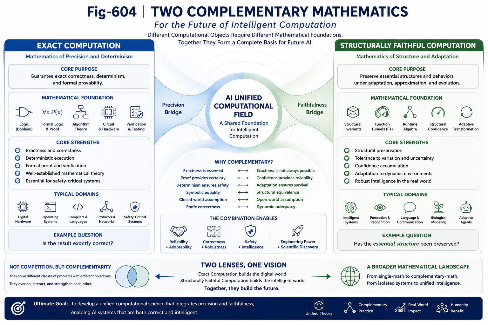

# GS-005 — Exact Computation and Structurally Faithful Computation

## Part VI — Grand Synthesis

---

# Abstract

Modern computer science has been built upon the extraordinary success of Exact Computation.

Boolean logic, formal verification, deterministic execution, and algorithmic correctness have established one of the most rigorous scientific foundations in engineering history.

Artificial Intelligence, however, increasingly operates on computational objects that are incomplete, uncertain, evolving, and structurally approximate.

This work argues that future AI does not diminish the importance of Exact Computation.

Instead, it suggests that AI may require an additional complementary mathematical framework for describing **Structurally Faithful Computation**—computation that preserves essential runtime structures while allowing controlled approximation, adaptation, and runtime evolution.

Together, these two perspectives form complementary foundations for future computational science.

---

---

# 1. The Achievement of Exact Computation

The digital revolution was made possible through Exact Computation.

Its foundations include:

* Boolean algebra;
* deterministic execution;
* formal logic;
* algorithmic correctness;
* compiler theory;
* formal verification;
* digital circuits.

These principles transformed computation into a rigorous engineering discipline.

Their importance cannot be overstated.

Modern civilization depends upon them.

---

# 2. A Different Class of Computational Objects

Artificial Intelligence increasingly encounters computational objects that differ fundamentally from traditional digital computation.

Examples include:

* natural language;
* perception;
* structural recognition;
* runtime adaptation;
* incomplete information;
* evolving environments;
* biological intelligence.

These objects rarely admit perfectly deterministic descriptions.

Instead, they evolve continuously while preserving essential structural identities.

---

# 3. Beyond Exactness

Traditional computation asks:

> Is the computation exactly correct?

Many AI problems instead ask:

> Has the essential structure been preserved?

This distinction changes the computational objective.

The goal is no longer exact symbolic identity alone.

The goal becomes faithful preservation of computationally significant runtime structures.

---

# 4. Structurally Faithful Computation

Structurally Faithful Computation refers to computational processes that preserve the essential organization of Runtime Objects while allowing controlled variation in representation or execution.

Examples may include:

* structural similarity;
* Runtime Invariants;
* Function Tunnel preservation;
* structural confidence;
* runtime organization;
* representation translation.

Exact equality is no longer the only meaningful criterion.

Structural preservation becomes equally important.

---

# 5. Complementary Mathematical Foundations

This work does not propose replacing Exact Computation.

Instead, it proposes complementing it.

Exact Computation emphasizes:

* correctness;
* determinism;
* formal proof;
* logical consistency.

Structurally Faithful Computation emphasizes:

* structural preservation;
* runtime continuity;
* confidence accumulation;
* adaptive computation;
* representation fidelity.

Each mathematical framework addresses different classes of computational objects.

---

# 6. Why Biology Matters

Biological intelligence provides an important observation.

Brains rarely perform perfectly deterministic symbolic computation.

Instead, they demonstrate:

* robustness;
* tolerance;
* adaptation;
* structural memory;
* gradual learning;
* runtime reorganization.

Survival depends not upon exact symbolic correctness alone, but upon preserving sufficiently faithful structural understanding of the environment.

This suggests that structurally faithful computation may represent a fundamental computational principle rather than merely an engineering approximation.

---

# 7. From Proof to Structural Confidence

Exact Computation often concludes with proof.

Structurally Faithful Computation frequently concludes with confidence.

Confidence should not be interpreted as mathematical weakness.

Instead, it represents an alternative computational objective appropriate for Runtime Objects whose exact symbolic descriptions may be unavailable, incomplete, or dynamically evolving.

Structural Confidence therefore complements formal proof rather than competing with it.

---

# 8. Runtime-Centric Mathematics

As Runtime Representation Theory develops, several mathematical directions naturally emerge.

Examples include:

* Runtime Invariant Algebra;
* Runtime Representation Theory;
* Representation Translation;
* structural preservation metrics;
* runtime organization operators;
* confidence accumulation;
* Runtime Object transformations.

Together these directions suggest the emergence of a Runtime-Centric Mathematics.

---

# 9. Computational Domains

Different mathematical frameworks naturally excel in different computational domains.

Exact Computation remains indispensable for:

* digital hardware;
* operating systems;
* compilers;
* communication protocols;
* safety-critical software;
* formal verification.

Structurally Faithful Computation becomes increasingly relevant for:

* intelligent systems;
* adaptive agents;
* runtime reasoning;
* structural recognition;
* biological modeling;
* hybrid AI systems.

These domains overlap but are not identical.

Their mathematical requirements therefore differ.

---

# 10. Toward Complementary Computation

Future computation may increasingly integrate both perspectives.

Exact Computation provides precision where symbolic correctness is essential.

Structurally Faithful Computation provides robustness where intelligent adaptation is required.

Together they support computational systems capable of both reliability and intelligence.

This integration represents cooperation rather than replacement.

---

# 11. A New Research Frontier

Developing a rigorous mathematics for Structurally Faithful Computation remains an open scientific challenge.

Important questions include:

* How should structural fidelity be measured?
* Which Runtime Invariants must be preserved?
* How should structural confidence accumulate?
* What mathematical properties govern Representation Translation?
* Which Runtime Objects admit faithful approximation?

Answering these questions may define an important direction for future AI theory.

---

# 12. Toward a Broader View of Computation

The history of computer science established one of humanity's greatest mathematical achievements through Exact Computation.

Artificial Intelligence now invites a broader perspective.

Rather than replacing that achievement, AI encourages extending it.

Future computational science may therefore be built upon two complementary foundations:

* Exact Computation, for deterministic symbolic systems.
* Structurally Faithful Computation, for adaptive runtime intelligence.

Together they provide a richer language for understanding both digital machines and intelligent systems.

---

# Key Takeaways

* Exact Computation remains one of the foundational achievements of computer science.
* AI increasingly operates on Runtime Objects that require different computational objectives.
* Structurally Faithful Computation complements Exact Computation rather than replacing it.
* Structural preservation becomes a primary computational criterion alongside exact symbolic correctness.
* Biological intelligence suggests that structural fidelity is a fundamental computational principle.
* Runtime-Centric Mathematics may provide a future mathematical foundation for intelligent computation.
* Future computational science may naturally integrate Exact and Structurally Faithful Computation into complementary theoretical frameworks.

---

## Relation to Part VI

The previous chapters introduced the AI Unified Computational Field, Runtime Representation Theory, the Runtime Representation Spectrum, and Representation Evolution.

This chapter extends the discussion beyond AI architectures into computational mathematics itself, arguing that future intelligent systems may require complementary mathematical foundations for different classes of computational objects.

The final chapter concludes Part VI with a manifesto describing the transition from scaling representations toward discovering Runtime Objects and establishing a unified future for Runtime Intelligence.
