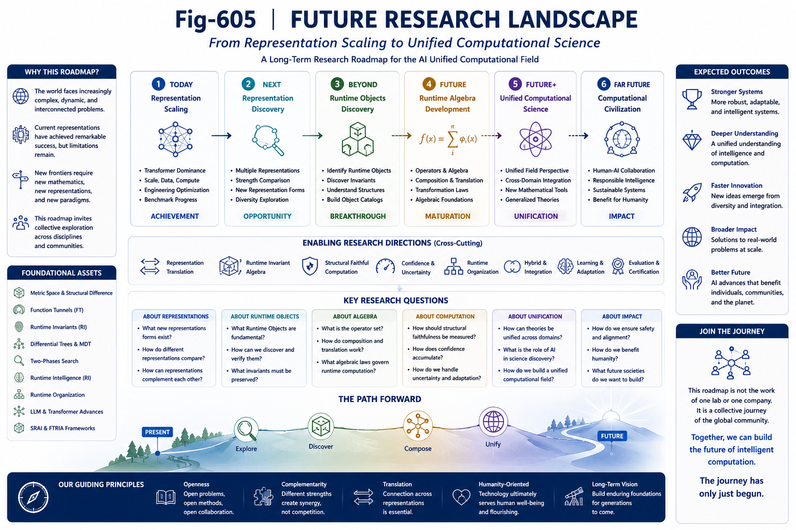
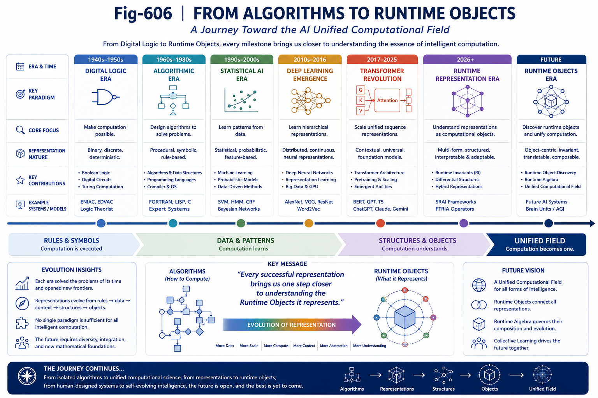

# GS-006 — Manifesto - From Scaling Representations to Discovering Runtime Objects

## Part VI — Grand Synthesis

---

# Abstract

Artificial Intelligence has entered an extraordinary period of scientific and engineering progress.

The remarkable success of large-scale neural computation has demonstrated that Runtime Representations can be scaled to unprecedented capability.

This achievement deserves recognition as one of the defining milestones in the history of computing.

At the same time, every major scientific advance opens new questions.

This manifesto proposes that the next stage of AI research may gradually expand from scaling existing Runtime Representations toward discovering Runtime Objects, Runtime Representation Families, and the broader AI Unified Computational Field.

The objective is not to replace existing paradigms, but to enlarge the scientific landscape in which they are understood.

---

---

---

---

# 1. Every Scientific Success Changes the Questions

Scientific revolutions rarely end a discipline.

Instead, they redefine its frontier.

Transformer-based AI has profoundly changed the practical capability of machine intelligence.

The natural question is therefore no longer only:

> How can existing representations become larger?

An equally important question now emerges:

> What are these representations actually representing?

The search for Runtime Objects naturally follows the success of Runtime Representations.

---

# 2. From Engineering Achievement to Scientific Understanding

Engineering often advances before theory.

History repeatedly demonstrates that successful systems are frequently built before their deeper principles are fully understood.

Artificial Intelligence may now be approaching such a moment.

Representation Scaling has revealed what is possible.

The next scientific challenge is to understand why.

Understanding Runtime Objects, Runtime Invariants, Runtime Representations, and their relationships becomes part of this broader effort.

---

# 3. Representation Is the Beginning, Not the End

Every successful Runtime Representation reveals only one region of a potentially much larger computational landscape.

Future research may discover additional representations emphasizing:

* structural organization;
* runtime transparency;
* retrieval efficiency;
* adaptive execution;
* representation translation;
* runtime algebra.

The Representation Spectrum therefore remains fundamentally open.

Scientific progress should continue to explore this broader landscape.

---

# 4. Toward Runtime Object Discovery

Representation Discovery naturally leads to a deeper objective.

Rather than discovering new representations alone, future AI may increasingly seek to identify the Runtime Objects shared across multiple representations.

These Runtime Objects may provide a more stable theoretical foundation for understanding intelligent computation than any individual implementation.

This shift represents a movement from implementation-centric thinking toward object-centric thinking.

---

# 5. Toward Runtime Representation Science

As Runtime Representation Theory matures, a broader scientific discipline may emerge.

Possible research directions include:

* Runtime Object discovery;
* Runtime Representation discovery;
* Runtime Representation translation;
* Runtime Representation composition;
* Runtime Representation evaluation;
* Runtime Representation certification;
* Runtime Representation algebra.

Together these directions define a coherent scientific program extending beyond individual AI architectures.

---

# 6. Toward Runtime-Centric Computing

The emergence of Runtime Objects naturally encourages new computational paradigms.

Future computing may increasingly emphasize:

* runtime organization;
* runtime adaptation;
* runtime migration;
* runtime-native operators;
* runtime algebra;
* structurally faithful computation.

These developments do not replace existing computing.

They extend its expressive power toward increasingly adaptive computational systems.

---

# 7. Toward a Broader Computational Mathematics

The future of AI may require complementary mathematical languages.

Exact Computation remains indispensable wherever deterministic symbolic correctness is required.

Structurally Faithful Computation becomes increasingly relevant wherever Runtime Objects evolve, adapt, or preserve structure under changing representations.

Together they provide a broader mathematical foundation for intelligent computation.

---

# 8. A Research Program Rather Than a Conclusion

The AI Unified Computational Field should not be viewed as a completed theory.

It is better understood as an open scientific program.

Its central questions remain subjects for future investigation:

* Which Runtime Objects exist?
* Which Runtime Invariants are fundamental?
* Which Runtime Representations belong to the same family?
* How should representations be translated?
* How should structural fidelity be measured?
* What constitutes a complete Runtime Algebra?

These questions define a long-term research agenda rather than immediate answers.

---

# 9. Collective Learning

The development of future AI is unlikely to depend upon a single algorithm, laboratory, or discipline.

Progress increasingly requires collaboration across:

* artificial intelligence;
* computer science;
* mathematics;
* engineering;
* cognitive science;
* neuroscience;
* systems research.

Collective Learning therefore becomes not merely a methodology, but an essential characteristic of future scientific discovery.

The AI Unified Computational Field is offered in this spirit.

---

# 10. An Invitation

This work does not ask the research community to abandon existing achievements.

It asks a simpler question.

If one successful Runtime Representation exists,

might others exist as well?

If multiple Runtime Representations exist,

might they share deeper Runtime Objects?

If Runtime Objects exist,

might they provide a broader language for understanding intelligence itself?

These questions remain open.

Exploring them together is the purpose of this research program.

---

# Closing Statement

The history of computing has repeatedly expanded through new abstractions.

From logic gates to programming languages.

From procedures to objects.

From symbolic computation to statistical learning.

Artificial Intelligence may now be approaching another transition.

Not from one architecture to another,

but from isolated computational representations toward a broader understanding of Runtime Objects, Runtime Representations, and the AI Unified Computational Field.

Whether this vision ultimately proves correct will be determined not by speculation, but by continued theoretical development, engineering validation, and collective scientific exploration.

The journey has only begun.

---

# Key Takeaways

* Representation Scaling marks a historic achievement in Artificial Intelligence.
* Runtime Object Discovery may become an important complementary scientific direction.
* Runtime Representation Science provides a broader framework for organizing AI research.
* Runtime-Centric Computing extends existing computational paradigms rather than replacing them.
* Exact Computation and Structurally Faithful Computation may form complementary mathematical foundations.
* The AI Unified Computational Field is presented as an open research program rather than a finished theory.
* Collective Learning is essential for advancing this next stage of intelligent computation.

---

## Conclusion of Part VI

**Part VI — Grand Synthesis** concludes the current stage of the Structural Runtime AI (SRAI) and Function Tunnel & Runtime Invariant Algebra (FTRIA) research program.

The six chapters have progressively developed:

* a unified computational perspective;
* Runtime Representation Theory;
* the Runtime Representation Spectrum;
* Representation Evolution;
* complementary computational mathematics;
* and a long-term research manifesto.

Together they propose a runtime-centric framework for understanding intelligent computation while inviting continued exploration, refinement, and validation by the broader scientific community.

The objective is not to close a field of study.

It is to help open one.
