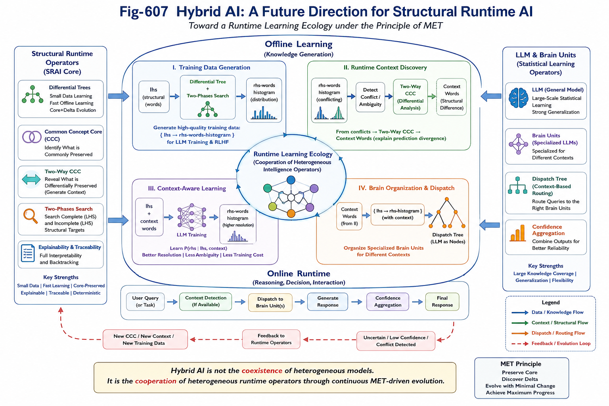

# GS-007 — Hybrid AI: A Future Direction for Structural Runtime AI

> *Hybrid AI is not merely the coexistence of heterogeneous AI models. It is the cooperation of heterogeneous runtime operators through continuous MET-driven evolution.*

---

# Abstract

The emergence of Large Language Models (LLMs) has demonstrated the extraordinary power of large-scale statistical learning. Meanwhile, Structural Runtime AI (SRAI) has developed a complementary family of runtime operators, including Differential Trees, Common Concept Core (CCC), Two-Way CCC, and Two-Phases Search, emphasizing structural recognition, minimal evolution, runtime organization, and explainable computation.

Rather than viewing these approaches as competing paradigms, SRAI suggests a different perspective:

**Future AI systems may become Hybrid AI systems, where multiple runtime operator families collaborate to continuously improve one another under the principle of Minimal Evolution Threshold (MET).**

This document outlines this research direction.

---



---

# From Model-Centric AI to Runtime-Centric Cooperation

Current AI research is often organized around individual model families.

Examples include:

- Large Language Models (LLMs)
- Knowledge Graphs
- Search Engines
- Rule Systems
- Reinforcement Learning
- World Models

In contrast, Structural Runtime AI views intelligence as a runtime ecosystem composed of specialized operators.

Different operator families may perform different roles:

- large-scale statistical learning
- structural recognition
- runtime search
- context discovery
- runtime dispatch
- confidence accumulation
- structural explanation
- continuous evolution

The objective is no longer to build one universal model, but to organize multiple operator families into a coherent runtime learning ecology.

---

# Differential Trees as Runtime Teachers

Differential Trees are not intended to replace LLMs.

Instead, they naturally serve as runtime structural analyzers capable of producing high-quality learning signals.

Compared with large-scale statistical learning, Differential Trees provide several complementary advantages:

- efficient Small Data learning
- fast offline learning
- Core + Delta evolution
- Core-Preserved incremental updates
- complete structural traceability
- explainable decision paths
- deterministic runtime behavior

In particular,

- Differential Trees excel at searching complete left-hand-side structural targets.
- Two-Phases Search naturally extends this capability to incomplete structural targets.

These capabilities make Structural Runtime operators well suited for generating high-quality supervision for large statistical models.

---

# Hybrid Direction I
## Structural Runtime Operators as Training Data Generators

One natural Hybrid AI architecture is:

```
Training Corpus
        │
        ▼
Differential Tree
        │
        ▼
{ lhs → rhs histogram }
        │
        ▼
LLM Training / Reinforcement Learning
```

Instead of learning only from raw text, future LLMs may also learn from structurally organized runtime knowledge generated by Structural Runtime operators.

This transforms raw corpus into reasoned corpus.

---

# Hybrid Direction II
## Runtime Context Discovery

Prediction ambiguity often appears as conflicting output distributions.

For example,

```
lhs

↓

multiple competing rhs distributions
```

Rather than treating these conflicts as noise, Hybrid AI may analyze them structurally.

Possible runtime pipeline:

```
Histogram

↓

Conflict Detection

↓

Two-Way CCC

↓

Context Discovery
```

The resulting structural differences naturally become candidate context descriptors.

In this view,

**Context is no longer manually engineered.**

Context becomes a runtime-discovered structural object.

---

# Hybrid Direction III
## Context-Aware Runtime Learning

After runtime context discovery,

future learning may evolve from

```
P(rhs | lhs)
```

toward

```
P(rhs | lhs, context)
```

where context itself is generated by runtime structural analysis rather than manually designed prompts.

This may significantly improve prediction resolution while reducing unnecessary model complexity and training cost.

---

# Hybrid Direction IV
## Runtime Brain Organization

Context discovery also enables another possibility.

Instead of placing every capability inside one giant model,

Hybrid AI may organize specialized Brain Units.

A possible runtime organization is:

```
User Query

↓

Runtime Context Detection

↓

Brain Dispatch

↓

Specialized Brain Units

↓

Response
```

Each Brain Unit may itself be an LLM specialized for particular structural contexts.

The dispatch process becomes a runtime organizational problem rather than a model scaling problem.

---

# Towards a Runtime Learning Ecology

Perhaps the most important implication is that runtime operators may continuously improve one another.

A possible long-term learning loop is:

```
LLM Prediction

↓

Uncertain Patterns

↓

Structural Runtime Analysis

↓

Differential Tree

↓

Two-Way CCC

↓

Context Discovery

↓

High-Quality Training Data

↓

LLM Update
```

Instead of isolated learning pipelines,

future Hybrid AI systems may evolve through continuous interaction among heterogeneous runtime operators.

---

# Relation to MET

This vision naturally follows the principle of Minimal Evolution Threshold (MET).

Rather than repeatedly rebuilding larger models,

Hybrid AI encourages:

- preserving reliable structural knowledge
- identifying minimal structural differences
- discovering runtime context
- incrementally improving specialized operators
- continuously organizing runtime intelligence

The result is not merely larger AI systems.

It is continuously evolving intelligence through minimal structural evolution.

---

# Outlook

Structural Runtime AI does not propose Hybrid AI as a finished architecture.

Instead, it proposes a research direction.

Future Hybrid AI may combine:

- Large Language Models
- Differential Trees
- Common Concept Core (CCC)
- Two-Way CCC
- Two-Phases Search
- Runtime Dispatch
- Brain Units
- additional runtime operator families yet to be discovered

The long-term objective is not simply integrating heterogeneous AI models.

It is building a runtime learning ecology in which heterogeneous intelligence operators cooperate, evolve, and continuously improve one another under the shared principle of Minimal Evolution Threshold.

This may represent one possible direction beyond today's model-centric AI toward the next generation of Structural Runtime AI.